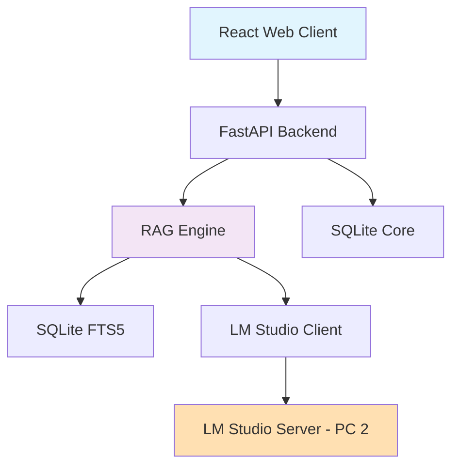
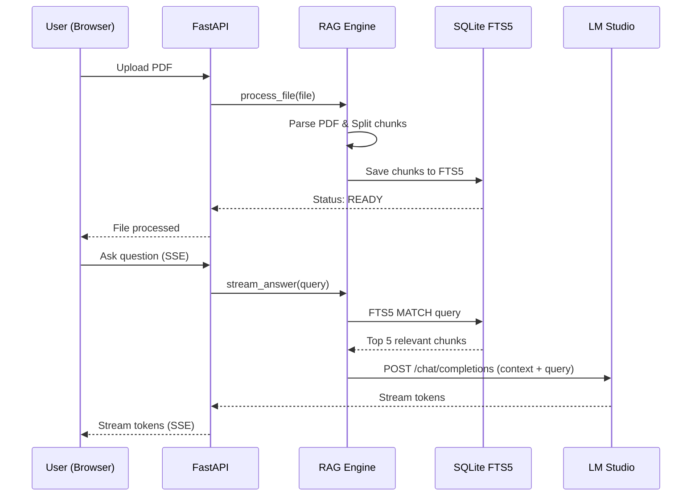

# 📝 Neuro-Dossier - AI-Powered Document Analysis Platform


**Веб-платформа для интеллектуального анализа документов с интеграцией локальной ИИ-модели**

## 📋 О проекте

Neuro-Dossier - это инновационная веб-платформа, сочетающая в себе интерфейс для загрузки документов и интеллектуального AI-помощника на базе LM Studio с моделью 14B. Проект предоставляет уникальную возможность загружать файлы (PDF, TXT) и получать точные ответы на вопросы, основываясь исключительно на загруженном контексте.

## 🚀 Основные возможности

- 📄 **Загрузка и парсинг документов** (PDF, TXT) с автоматической нарезкой на чанки
- 🤖 **AI-анализ документов** с ответами строго по контексту загруженных файлов
- 🔍 **Полнотекстовый поиск (FTS5)** для быстрого поиска релевантных фрагментов
- 💬 **Потоковый вывод ответов** (SSE) для мгновенного отображения генерации ИИ
- 📚 **Отслеживание источников** — указание, из какого документа взят ответ
- 💾 **История чатов** и управление загруженными файлами

## 🏗 Архитектура

```
┌─────────────────┐    ┌──────────────────┐    ┌─────────────────┐
│   Web Client    │◄──►│   FastAPI        │◄──►│   LM Studio     │
│   (React Vite)  │    │   Backend Core  │    │   (14B Model)   │
└─────────────────┘    └──────────────────┘    └─────────────────┘
                                │
                                ▼
                        ┌─────────────────┐
                        │   SQLite FTS5   │
                        │ (Docs/Chunks)   │
                        └─────────────────┘
```

## ⚡ Быстрый старт

```bash
# Клонирование репозитория
git clone https://github.com/yourusername/Neuro-Dossier.git
cd Neuro-Dossier

# --- Настройка Backend ---
cd backend
pip install -r requirements.txt
cp .env.example .env
# Настройте URL до LM Studio в .env

# Запуск backend
uvicorn main:app --host 0.0.0.0 --port 8000

# --- Настройка Frontend ---
cd ../frontend
npm install
npm run dev
```

## 📖 Документация

Полная документация проекта доступна в папке [docs/](./docs/):

- [Бизнес-требования](./docs/01-business-requirements.md)
- [Системный анализ](./docs/02-system-analysis.md)
- [План архитектуры](./docs/03-architecture-plan.md)
- [Техническое задание](./docs/04-technical-specification.md)
- [План тестирования](./docs/05-testing-plan.md)

## 🛠 Технологический стек

- **Frontend**: React, Vite, TailwindCSS
- **Backend**: Python 3.10+, FastAPI, PyPDF2
- **AI Integration**: LM Studio (Qwen 14B / Llama 3)
- **Database**: SQLite + FTS5 (Полнотекстовый поиск)
- **Architecture**: Async/await, SSE Streaming, Custom RAG

## 👥 Команда разработки

| Роль | Разработчик | 
|------|-------------|
| Team Lead & Backend | Разраб 1 |
| AI/ML Engineer | Разраб 2 |
| Frontend Developer | Веб-разработчик |
| DevOps & Integration | Разраб 3 |

---

*Документация подготовлена командой Neuro-Dossier*

---

# Бизнес-требования

## 1. Обзор проекта

**Neuro-Dossier** - веб-платформа для анализа документов, предназначенная для извлечения точной информации из больших массивов текста (PDF, TXT) с использованием искусственного интеллекта.

## 2. Цели проекта

### 2.1. Бизнес-цели
- Создать доступный инструмент для быстрого поиска информации в документах
- Автоматизировать процесс анализа текста через AI-ассистента
- Обеспечить прозрачность ответов ИИ через привязку к источникам

### 2.2. Пользовательские цели
- Получение точных ответов на вопросы по загруженным документам
- Избежание "галлюцинаций" ИИ за счет жесткого контекста
- Экономия времени на ручном чтении больших файлов

## 3. Решаемые проблемы

### 3.1. Основные проблемы
- **Сложность поиска** - ручной поиск по PDF-документам неэффективен
- **Потеря контекста** - обычный Ctrl+F не понимает смысла и связей между абзацами
- **Недоверие к ИИ** - ChatGPT может выдумать факты, не основываясь на ваших данных

### 3.2. Решение Neuro-Dossier
- 📄 **RAG-подход** - ИИ отвечает только на основе загруженных документов
- 🔍 **Умный поиск** - использование FTS5 для выборки релевантных кусков текста
- 📚 **Цитирование** - указание конкретных файлов-источников для каждого ответа

## 4. Целевая аудитория

| Группа | Описание | Основные потребности |
|--------|-----------|---------------------|
| **Аналитики** | Работа с отчетами и логами | Быстрый поиск метрик и инцидентов |
| **Студенты** | Исследование научных статей | Выжимка сути из больших PDF |
| **Юристы** | Анализ договоров | Поиск конкретных пунктов и оговорок |

## 5. Основные возможности

### 5.1. High-Level Features
1. **📄 Управление документами**
   - Загрузка файлов через Drag-and-Drop
   - Отслеживание статусов обработки
   - Хранение метаданных в SQLite

2. **🤖 AI-анализ и Q&A**
   - Интерактивный чат с ИИ по документам
   - Потоковая генерация ответов (SSE)
   - Промпт-инженерия под слабые модели (14B)

3. **🔍 Поиск и источники**
   - Полнотекстовый поиск по чанкам (FTS5)
   - Отображение источников под ответами ИИ
   - Сохранение истории чатов

## 6. Критерии успеха

### 6.1. Количественные метрики
- 90%+ ответов ИИ основаны строго на загруженном контексте
- <3 секунд на поиск релевантных чанков
- Поддержка 10+ одновременных пользователей веб-интерфейса

### 6.2. Качественные метрики
- Отсутствие галлюцинаций при ответах по документам
- Интуитивно понятный веб-интерфейс
- Понятные ссылки на источники информации

---

*Документация подготовлена командой Neuro-Dossier*

---

# Системный анализ

## 1. Функциональные требования

### 1.1. Управление пользователями и сессиями
- **Веб-доступ** к платформе с любых устройств через браузер
- **Создание чатов** для изолированного анализа разных документов
- **История взаимодействий** в рамках сессии

### 1.2. Работа с документами
- **📤 Загрузка файлов**
  - Поддержка форматов PDF, TXT
  - Автоматическая нарезка текста на чанки (1000 символов, перекрытие 200)
  - Индексация чанков в FTS5

- **📊 Управление статусами**
  - Отслеживание процесса обработки файла
  - Статусы: `PROCESSING`, `READY`, `ERROR`

### 1.3. AI-аналитика и чат
- **💬 Взаимодействие с ИИ**
  - Отправка вопроса пользователем
  - Потоковая генерация ответа (SSE)
  - Форматирование ответа через Markdown

- **🎯 RAG-пайплайн**
  - Поиск релевантных чанков через FTS5 по ключевым словам запроса
  - Формирование строгого промпта с контекстом
  - Отправка в LM Studio (14B модель)

## 2. Нефункциональные требования

### 2.1. Производительность
- **Время отклика UI**: <1 секунды для загрузки страниц
- **Поиск FTS5**: <500 мс на поиск чанков
- **AI-генерация**: Первый токен <3 секунд, стриминг посимвольно

### 2.2. Архитектурные особенности
- **Кастомный RAG**: Отказ от тяжелых фреймворков (LangChain) для оптимизации под 14B модели
- **FTS5 вместо ChromaDB**: Полнотекстовый поиск SQLite быстрее и легче векторных баз для слабых моделей
- **Микросервисность**: Frontend, Backend и LM Studio разделены и общаются по сети

### 2.3. Надежность
- **Доступность**: 95% uptime при запущенном бэкенде и LM Studio
- **Обработка ошибок**: Информативные сообщения при ошибках парсинга или недоступности ИИ

## 3. Технологический стек

### 3.1. Frontend
- **Фреймворк**: React + Vite
- **Стилизация**: TailwindCSS
- **Запросы**: Fetch API (SSE для стриминга)

### 3.2. Backend
- **Язык**: Python 3.10+
- **Фреймворк**: FastAPI (Uvicorn)
- **Парсинг**: PyPDF2,内置 open() для txt

### 3.3. База данных
- **Основная**: SQLite
- **Поиск**: FTS5 (Virtual Table)
- **ORM**: Встроенный sqlite3 / aiosqlite

### 3.4. Искусственный интеллект
- **Сервер**: LM Studio (на отдельном ПК в локальной сети)
- **API**: RESTful совместимость с OpenAI API
- **Оптимизация**: Сырые промпты, минимальный оверхед

## 4. Ограничения системы

### 4.1. Технические ограничения
- Качество ответов ограничено мощностью 14B модели (может галлюцинировать на сложных логических связях)
- FTS5 ищет по совпадению слов, а не по семантике (в отличие от векторных БД)
- Размер контекста ограничен окном модели (обычно 8k-32k токенов)

### 4.2. Функциональные ограничения
- Поддержка только текстовых данных (сканы PDF без OCR не обрабатываются)
- Загрузка файлов по одному (без батчевой обработки)

---

*Документация подготовлена командой Neuro-Dossier*

---

# План архитектуры

## 1. Общая архитектура системы

Neuro-Dossier построен по разделенной 3-звенной архитектуре: Клиент (сайт), Сервер (бэкенд + БД), ИИ (LM Studio на отдельном ПК).



## 2. Компоненты системы

### 2.1. Frontend Components

#### **🌐 Web Client (`App.tsx`, `Chat.tsx`)**
- **Назначение**: Пользовательский интерфейс платформы
- **Технологии**: React, Vite, TailwindCSS
- **Ответственность**:
  - Экран логина и управления чатами
  - Компоненты загрузки файлов (Drag-n-Drop)
  - Рендер поточных ответов ИИ (Markdown)
  - Динамическое определение API_URL для связи с бэкендом

### 2.2. Backend Components

#### **⚙️ Backend Core (`main.py`)**
- **Назначение**: REST API сервер, точка входа
- **Технологии**: FastAPI, Uvicorn
- **Ответственность**:
  - Маршрутизация запросов от клиента
  - Управление фоновыми задачами (парсинг файлов)
  - Проксирование SSE стрима от ИИ к клиенту

#### **🧠 RAG Engine (`rag_engine.py`)**
- **Назначение**: Кастомная логика генерации с дополненной выборкой
- **Ответственность**:
  - Нарезка документов на чанки
  - Формирование поискового запроса к FTS5
  - Сборка промпта: "Контекст: {chunks} \n Вопрос: {query}"
  - Вызов LM Studio API с потоковой генерацией

#### **💾 Database Service (`database.py`)**
- **Назначение**: Хранение данных и полнотекстовый поиск
- **Технологии**: SQLite, FTS5
- **Ответственность**:
  - CRUD операции с метаданными файлов и чатов
  - Индексация и поиск чанков через виртуальную таблицу FTS5

### 2.3. AI Components

#### **📡 LLM Client (`lm_client.py`)**
- **Назначение**: Взаимодействие с LM Studio по локальной сети
- **Протокол**: HTTP REST API (OpenAI-совместимый)
- **Особенности**: Настройка URL на IP второго ПК, стриминг ответов

## 3. Взаимодействие компонентов

### 3.1. Последовательность загрузки и анализа



## 4. Потоки данных

### 4.1. Документные данные
```
File Upload -> FastAPI -> PyPDF2 -> Text Chunks -> 
SQLite FTS5 Index -> Status Update
```

### 4.2. Запросы пользователей
```
User Query -> FastAPI -> FTS5 Search -> Context Assembly -> 
LM Studio API -> Stream Tokens -> SSE -> React UI
```

## 5. Масштабируемость и расширяемость

### 5.1. Горизонтальное масштабирование
- Frontend полностью независим и может хоститься отдельно (CDN/Nginx)
- Backend можно масштабировать за счет выноса SQLite на PostgreSQL

### 5.2. Расширение функциональности
- Замена FTS5 на векторную БД при усилении моделей
- Поддержка новых форматов (Docx, CSV) через добавление парсеров
- Подключение облачных LLM (OpenAI) через замену LLM Client

---

*Документация подготовлена командой Neuro-Dossier*

---

# Техническое задание

## 1. Объем работ

### 1.1. Основные модули разработки

#### **Модуль 1: Базовая инфраструктура** 
- [ ] Настройка Frontend (Vite + React + Tailwind)
- [ ] Настройка Backend (FastAPI + SQLite)
- [ ] Конфигурационная система (.env)
- [ ] Настройка LM Studio и сетевого соединения

#### **Модуль 2: База данных и FTS5**
- [ ] Проектирование схемы данных (Файлы, Чанки, Чаты)
- [ ] Реализация FTS5 виртуальной таблицы
- [ ] Сервис работы с БД (aiosqlite)

#### **Модуль 3: RAG Engine и парсинг**
- [ ] Парсинг PDF и TXT файлов
- [ ] Логика нарезки на чанки (1000 символов / 200 overlap)
- [ ] Полнотекстовый поиск через FTS5
- [ ] Форматирование промптов под 14B модель

#### **Модуль 4: LLM Интеграция**
- [ ] HTTP клиент для LM Studio API
- [ ] Реализация потоковой генерации (stream=True)
- [ ] Обработка таймаутов и ошибок соединения

#### **Модуль 5: Frontend UI**
- [ ] Дашборд с загрузкой файлов (Drag-n-Drop)
- [ ] Интерфейс чата с поточным рендером
- [ ] Рендер Markdown и отображение источников
- [ ] Адаптивная верстка (Desktop / Mobile)

#### **Модуль 6: Интеграция и тестирование**
- [ ] Связка Frontend <-> Backend (SSE)
- [ ] Тестирование RAG пайплайна
- [ ] UI/UX полировка

### 1.2. Оценка сложности задач

| Задача | Сложность | Исполнитель |
|--------|-----------|-------------|
| **Базовая структура проекта** | 4 часа | Team Lead |
| **База данных и FTS5** | 8 часов | Backend |
| **RAG Engine и парсинг** | 14 часов | AI/ML Engineer |
| **LLM Интеграция** | 8 часов | AI/ML Engineer |
| **Frontend UI** | 16 часов | Frontend Dev |
| **Интеграция по сети** | 6 часов | DevOps |
| **Тестирование и отладка** | 8 часов | Вся команда |
| **Итого** | **64 часа** | **4 разработчика** |

## 2. Сроки реализации

### 2.1. Общий дедлайн
- **Плановый срок**: 1 неделя (7 дней по 2 часа = 14 человеко-часов на рыло)

### 2.2. Детальный план выполнения

#### **Спринт 1: Базовая структура и БД** (Дни 1-2)
- День 1: Инициализация FastAPI, React, настройка .env, подключение к LM Studio
- День 2: SQLite схема, реализация FTS5, API для загрузки файлов

#### **Спринт 2: RAG Engine** (Дни 3-4)
- День 3: Парсинг PDF/TXT, нарезка на чанки, сохранение в FTS5
- День 4: Поиск по FTS5, сборка промпта, стриминг от LM Studio

#### **Спринт 3: Frontend UI** (Дни 5-6)
- День 5: Дашборд, загрузка файлов, список статусов обработки
- День 6: Интерфейс чата, SSE клиент, Markdown рендер, источники

#### **Спринт 4: Финальная сборка** (День 7)
- День 7: Связка UI и API, тестирование на разных устройствах в сети, фикс багов

## 3. Технические детали реализации

### 3.1. Ключевые архитектурные решения

#### **Кастомный RAG без LangChain**
```python
# Оптимизация под слабые модели: минимум абстракций, прямой вызов
async def stream_answer(query: str):
    chunks = await db_fts5_search(query) # Прямой SQL запрос
    prompt = f"Контекст:\n{chunks}\n\nВопрос: {query}\nОтвет:"
    async for token in lm_client.stream(prompt):
        yield token
```

#### **SSE Стриминг от FastAPI к React**
```python
# Backend (FastAPI)
@router.post("/chat/stream")
async def chat_stream(request: ChatRequest):
    return StreamingResponse(
        rag_engine.stream_answer(request.query), 
        media_type="text/event-stream"
    )
```

### 3.2. Оптимизация под 14B модели
- Строгий системный промпт, запрещающий выход за рамки контекста
- FTS5 вместо векторного поиска (снижает нагрузку на CPU, ищет по ключевым совпадениям)
- Небольшой размер чанков (1000 символов), чтобы не перегружать контекстное окно модели

## 4. Критерии приемки

### 4.1. Функциональные критерии
- [ ] Загрузка PDF/TXT работает корректно, текст нарезается на чанки
- [ ] ИИ отвечает только на основе контекста загруженных документов
- [ ] Ответы генерируются в потоке (появляются посимвольно)
- [ ] Под ответами указаны источники (имена файлов)

### 4.2. Технические критерии
- [ ] Сайт открывается с любого устройства в локальной сети
- [ ] Бэкенд стабильно держит 10+ одновременных веб-сокетов/SSE
- [ ] FTS5 поиск занимает <500 мс

### 4.3. Пользовательские критерии
- [ ] Понятный интерфейс загрузки и чата
- [ ] Корректное отображение Markdown форматирования в ответах ИИ

---

*Документация подготовлена командой Neuro-Dossier*

---

# План тестирования

## 1. Стратегия тестирования

### 1.1. Общий подход
Тестирование Neuro-Dossier проводится с акцентом на **интеграционное тестирование потоков данных (SSE)** и **оценку качества RAG-пайплайна**, так как это критические компоненты системы.

### 1.2. Уровни тестирования
- **🔧 Модульное тестирование**: Парсеры файлов, нарезка чанков, FTS5 запросы
- **🔄 Интеграционное тестирование**: Связка FastAPI <-> LM Studio, React <-> FastAPI SSE
- **🎯 Системное тестирование**: Полный цикл от загрузки файла до получения ответа
- **👥 Приемочное тестирование**: Удобство UI на различных устройствах (ПК, смартфоны)

## 2. Объекты тестирования

### 2.1. Ключевые модули для тестирования

#### **📄 Документный пайплайн**
- Парсинг PDF (извлечение текста без артефактов)
- Нарезка на чанки (соблюдение перекрытия overlap)
- Индексация в FTS5 (все чанки проиндексированы)

#### **🤖 RAG и AI компоненты**
- Качество поиска FTS5 (релевантность выданных чанков)
- Сборка промпта (вмещается в контекстное окно 14B)
- Стриминг от LM Studio (корректность токенов, SSE формат)

#### **🌐 Веб-интерфейс**
- Drag-and-Drop загрузка
- Рендер поточного Markdown
- Работа API_URL на разных устройствах в сети

## 3. Методы тестирования

### 3.1. Функциональное тестирование

#### **Тест-кейсы документного пайплайна**
```python
Test Case: "Загрузка и парсинг PDF"
- Действие: Загрузить валидный PDF файл размером 5 МБ
- Ожидаемый результат: 
  ✓ Файл сохранен на диске
  ✓ Текст извлечен и разбит на чанки
  ✓ Статус файла изменен на READY
  ✓ Чанки проиндексированы в FTS5
```

#### **Тест-кейсы RAG-генерации**
```python
Test Case: "Ответ строго по контексту"
- Предусловие: Загружен документ "Отчет_2023.pdf"
- Действие: Вопрос "Какова выручка за 2023 год?"
- Ожидаемый результат:
  ✓ FTS5 находит чанк с упоминанием выручки
  ✓ ИИ формирует ответ на основе этого чанка
  ✓ Под ответом указан источник "Отчет_2023.pdf"
  ✓ Ответ генерируется в потоке (SSE)
```

### 3.2. Интеграционное тестирование

#### **Сценарии взаимодействия**
1. **Полный цикл анализа**
   ```
   Открытие сайта -> Загрузка файла -> Ожидание статуса READY -> 
   Отправка вопроса -> Потоковый ответ ИИ -> Проверка источника
   ```

2. **Мультипользовательский режим**
   ```
   Device A открывает сайт -> Device B открывает сайт -> 
   Оба отправляют запросы -> Оба получают корректный стриминг
   ```

### 3.3. Тестирование UI/UX

#### **Кроссдевайс тестирование**
- Отображение чата на мобильных устройствах (адаптивность Tailwind)
- Корректная работа EventSource/Fetch на разных браузерах (Chrome, Safari, Firefox)

## 4. Критерии успеха тестирования

### 4.1. Критерии прохождения тестов

#### **Функциональные критерии**
- ✅ PDF и TXT файлы успешно парсятся и индексируются
- ✅ ИИ не использует знания вне загруженных документов (нет галлюцинаций)
- ✅ Потоковый ответ отображается без обрывов соединения
- ✅ Сайт доступен с других ПК в локальной сети

#### **Производительностные критерии**
- ✅ Время индексации файла < 5 секунд на 1 МБ текста
- ✅ Задержка перед первым токеном ответа ИИ < 3 секунд
- ✅ UI не блокируется во время стриминга или загрузки файлов

#### **Критерии удобства использования**
- ✅ Понятный интерфейс загрузки и чата
- ✅ Корректное отображение Markdown (списки, жирный шрифт, код)

### 4.2. Критерии завершения тестирования

- **Прохождение 95%+ тест-кейсов**
- **Отсутствие критических багов** (обрывы стрима, потеря данных при парсинге)
- **Удовлетворительные показатели качества RAG** (ИИ отвечает по делу)

## 5. Инструменты тестирования

### 5.1. Автоматизированное тестирование
- **pytest + aiosqlite** - тестирование логики БД и FTS5
- **httpx** - асинхронные запросы к FastAPI для тестирования эндпоинтов
- **Jest / React Testing Library** - модульное тестирование UI компонентов

### 5.2. Ручное тестирование
- **Проверка стриминга** глазами на плавность появления текста
- **Тестирование на разных устройствах** (ПК, телефон в одной Wi-Fi сети)
- **Валидация промптов** - оценка адекватности ответов 14B модели

## 6. Результаты тестирования

### 6.1. Статус тестирования
- **Модульное тестирование**: ⏳ В процессе
- **Интеграционное тестирование**: ⏳ В процессе
- **Системное тестирование**: ⏳ В процессе
- **Приемочное тестирование**: ⏳ В процессе

### 6.2. Ключевые зоны риска
- **Качество 14B модели**: Модель может не следовать инструкциям строго, требует ручной настройки промпта
- **FTS5 vs Семантика**: Полнотекстовый поиск может не найти нужный чанк, если слова в вопросе не совпадают со словами в тексте (решается подбором синонимов в промпте)

---

*Документация подготовлена командой Neuro-Dossier*
