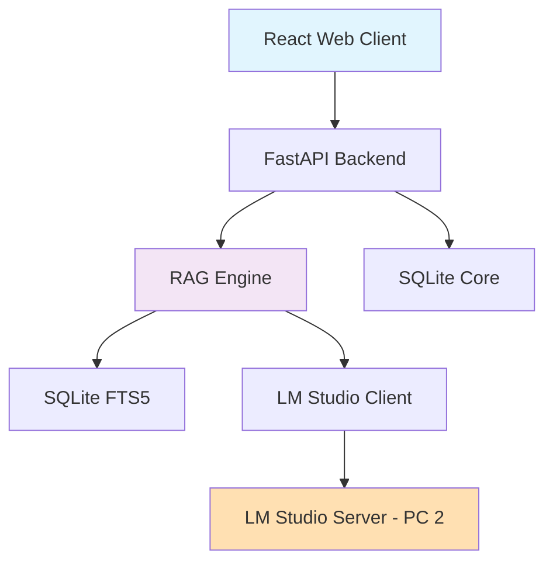
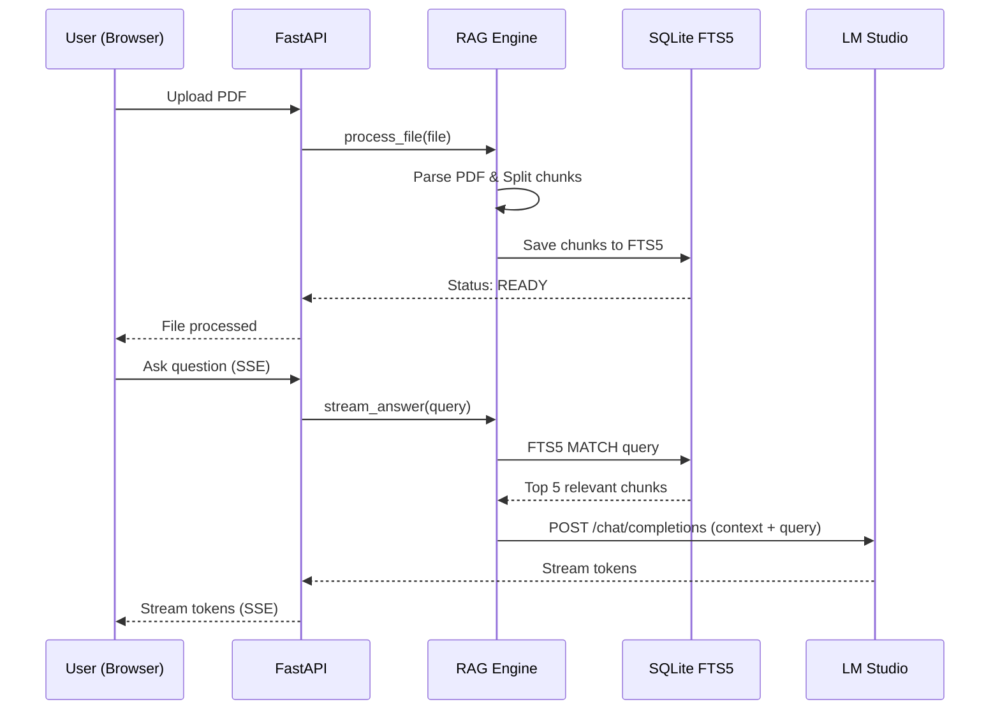

# План архитектуры

## 1. Общая архитектура системы

Neuro-Dossier построен по разделенной 3-звенной архитектуре: Клиент (сайт), Сервер (бэкенд + БД), ИИ (LM Studio на отдельном ПК).



## 2. Компоненты системы

### 2.1. Frontend Components

#### **🌐 Web Client (`App.tsx`, `Chat.tsx`)**
- **Назначение**: Пользовательский интерфейс платформы
- **Технологии**: React, Vite, TailwindCSS
- **Ответственность**:
  - Экран логина и управления чатами
  - Компоненты загрузки файлов (Drag-n-Drop)
  - Рендер поточных ответов ИИ (Markdown)
  - Динамическое определение API_URL для связи с бэкендом

### 2.2. Backend Components

#### **⚙️ Backend Core (`main.py`)**
- **Назначение**: REST API сервер, точка входа
- **Технологии**: FastAPI, Uvicorn
- **Ответственность**:
  - Маршрутизация запросов от клиента
  - Управление фоновыми задачами (парсинг файлов)
  - Проксирование SSE стрима от ИИ к клиенту

#### **🧠 RAG Engine (`rag_engine.py`)**
- **Назначение**: Кастомная логика генерации с дополненной выборкой
- **Ответственность**:
  - Нарезка документов на чанки
  - Формирование поискового запроса к FTS5
  - Сборка промпта: "Контекст: {chunks} \n Вопрос: {query}"
  - Вызов LM Studio API с потоковой генерацией

#### **💾 Database Service (`database.py`)**
- **Назначение**: Хранение данных и полнотекстовый поиск
- **Технологии**: SQLite, FTS5
- **Ответственность**:
  - CRUD операции с метаданными файлов и чатов
  - Индексация и поиск чанков через виртуальную таблицу FTS5

### 2.3. AI Components

#### **📡 LLM Client (`lm_client.py`)**
- **Назначение**: Взаимодействие с LM Studio по локальной сети
- **Протокол**: HTTP REST API (OpenAI-совместимый)
- **Особенности**: Настройка URL на IP второго ПК, стриминг ответов

## 3. Взаимодействие компонентов

### 3.1. Последовательность загрузки и анализа



## 4. Потоки данных

### 4.1. Документные данные
```
File Upload -> FastAPI -> PyPDF2 -> Text Chunks -> 
SQLite FTS5 Index -> Status Update
```

### 4.2. Запросы пользователей
```
User Query -> FastAPI -> FTS5 Search -> Context Assembly -> 
LM Studio API -> Stream Tokens -> SSE -> React UI
```

## 5. Масштабируемость и расширяемость

### 5.1. Горизонтальное масштабирование
- Frontend полностью независим и может хоститься отдельно (CDN/Nginx)
- Backend можно масштабировать за счет выноса SQLite на PostgreSQL

### 5.2. Расширение функциональности
- Замена FTS5 на векторную БД при усилении моделей
- Поддержка новых форматов (Docx, CSV) через добавление парсеров
- Подключение облачных LLM (OpenAI) через замену LLM Client

---

*Документация подготовлена командой Neuro-Dossier*

---
